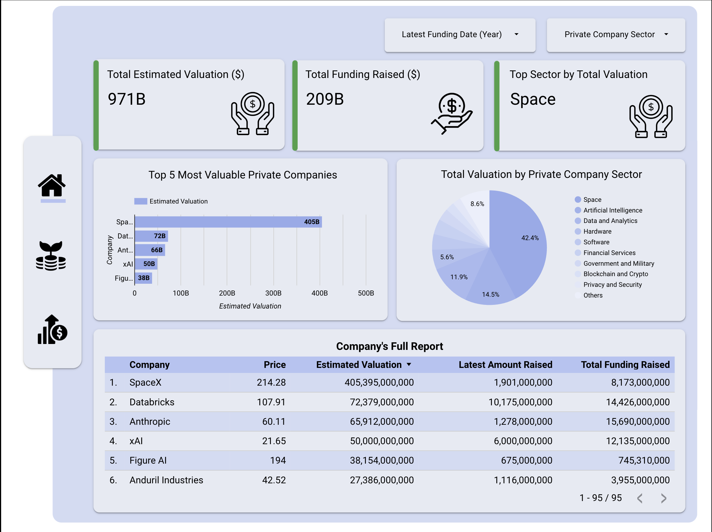
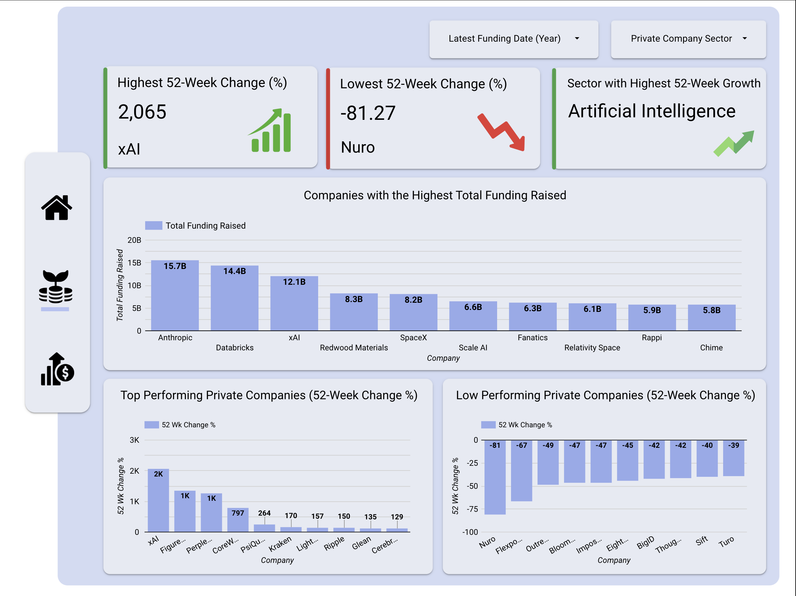
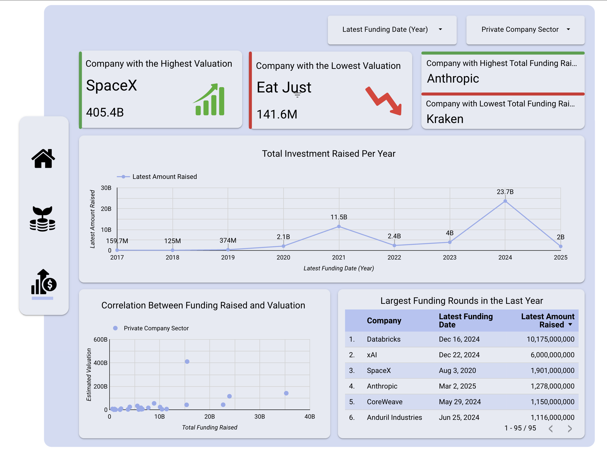

# # **Private Companies Valuation & Funding Analysis**

## **📌 Project Overview**
This project involves scraping, cleaning, analyzing, and visualizing private company data related to valuations and funding. The dataset is sourced from Yahoo Finance's **[Private Companies - Highest Valuation](https://finance.yahoo.com/markets/private-companies/highest-valuation/?start=0&count=150)** page. The analysis provides insights into company valuations, total funding, sector distributions, and trends in private market investments.

## **📑 Table of Contents**
- [Project Overview](#project-overview)
- [Tech Stack](#tech-stack)
- [Data Collection](#data-collection)
- [Data Cleaning & Preprocessing](#data-cleaning--preprocessing)
- [Data Analysis & Insights](#data-analysis--insights)
- [Visualization & Dashboard](#visualization--dashboard)
- [Dashboard Pages](#dashboard-pages)
- [Full Report](#full-report)

---

## **🛠 Tech Stack**
- **Python**: Data scraping, cleaning, and analysis
- **Libraries**:
  - `requests`, `BeautifulSoup4`: Web scraping
  - `pandas`, `numpy`: Data manipulation
  - `matplotlib`, `seaborn`: Data visualization in Python
  - `Google Looker Studio`: Interactive dashboard creation

---

## **🔍 Data Collection**
The dataset was scraped from Yahoo Finance using **BeautifulSoup** and **requests**. The scraped data includes details on:
- **Symbol**
- **Company**
- **Price**
- **52-Week Change (%)**
- **Estimated Valuation**
- **Total Funding Raised**
- **Latest Funding Date**
- **Latest Amount Raised**
- **Latest Round Share Class**
- **Private Company Sector**

The scraping script extracts this data and the scraping script code is located in the **[cweb scraping code](web scraping code.py)** file.

The scraped data is saved in the **[cleaned private companies csv](cleaned_private_companies.csv)** file.

---

## **🧹 Data Cleaning & Preprocessing**
Using **pandas**, the dataset was cleaned to ensure consistency:
1. **Handling missing values**: Rows missing `Latest Funding Date`, `Latest Amount Raised`, and `Latest Round Share Class` were removed.
2. **Data Type Conversion**:
   - Removed the `%` from the `52 Wk Change %` column.
   - Extracted numeric values from `Price` (removed unnecessary details in brackets).
   - Standardized `Estimated Valuation`, `Total Funding Raised`, and `Latest Amount Raised` by converting values ending with `B` (billion) and `M` (million) to full numbers.
   - Converted `Price`, `Estimated Valuation`, `Total Funding Raised`, and `Latest Amount Raised` columns to numeric data type.
   - Converted `Latest Funding Date` column to date type.
3. **Saved the cleaned dataset as a CSV file** for further analysis.

The cleaning script is available in the [Markets Private Companies - Yahoo Finance](Markets-Private-Companies-Yahoo-Finance.ipynb) file

---

## **📊 Data Analysis & Insights**
Key insights derived from the dataset:
- **Top 10 private companies by valuation**
- **Industry distribution of private companies**
- **Funding vs. valuation trends**
- **Top sectors receiving investment**
- **Companies with the highest 52-week growth**
- **Sector-wise 52-week performance**

---

## **📈 Visualization & Dashboard**
An **interactive dashboard** was created using **Google Looker Studio** to visualize:
- **Total Estimated Valuation of All Private Companies** (Scorecard)
- **Total Funding Raised Across All Companies** (Scorecard)
- **Top Sector by Total Valuation** (Scorecard)
- **Company with the Highest and Lowest 52-week change** (Scorecards)
- **Sector with the Highest 52-week change** (Scorecard)
- **Company with the Highest and Lowest Valuation** (Scorecards)
- **Company with the Highest and Lowest Total FUnding Raised** (Scorecards)

- **Top 5 Private Companies by Estimated Valuation** (Horizontal Bar Chart)
- **Total Valuation by Private Company Sector** (Pie Chart)
- **Company's Full Report** (Table)
- **Top 10 Companies with Highest Funding Raised** (Vertical Bar Chart)
- **Companies with the Highest 52-Week Growth** (Vertical Bar Chart)
- **Companies with the Lowest 52-Week Growth** (Vertical Bar Chart)
- **Total Investment Raised Per Year** (Line chart)
- **Correlation Between Funding Raised and Valuation** (Scatter plot/chart)
- **Largest Funding Rounds in the Last Year** (Table)

---

## **📑 Dashboard Pages**👇
 
 
 

## **📑 Full Report**👇
- Visit [full report page on Google Looker Studio](https://lookerstudio.google.com/s/pcvZUqVSLP4)

- 